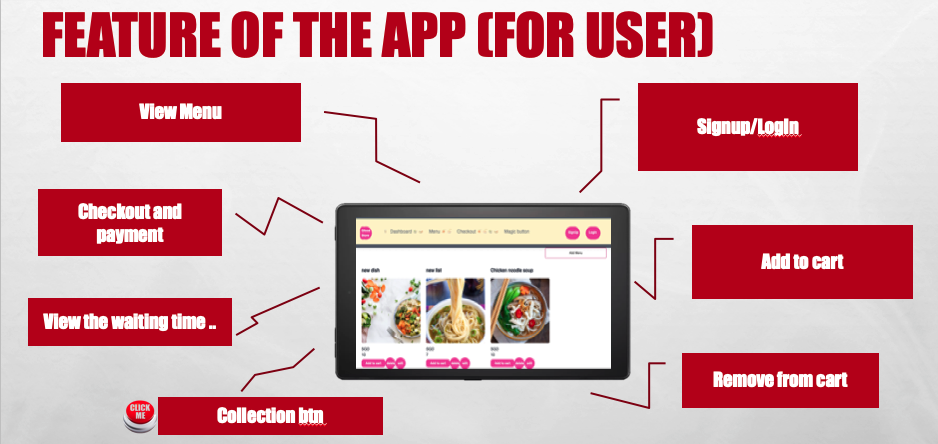
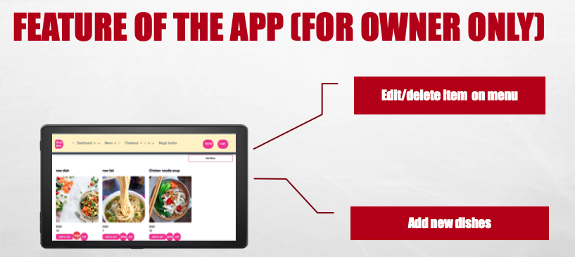
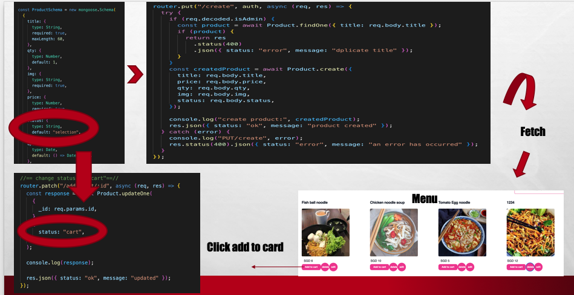

# :page_with_curl: Project 4 (Food ordering system(Menu)) :ramen:

This is an app for target for Hawker Centre store to use , user able to make an order from this app.

## Technologies Used

MERN - Front-end React Express :electron: - Back-end MongoDB - Database Mongoose - Schema JSON Web Token - Authentication

## Feature of the App (for User) :person_in_tuxedo:

## Feature of the App (for Owner) :superhero_man:

## Getting Started :computer:

(User)

1. able to view menu
2. add to cart
3. remove from item from cart
4. checkout and make payment
5. view waiting time
6. click btn for collection

(Owner)

1. edit / remove menu
2. add new dishes

\*using status:"selection" => "cart" => "completed" done.

### Unsolved problems

1. qty issue
2. random btn is not working
